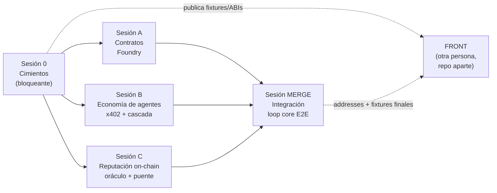

# Sesiones de desarrollo — Karma (anillo 1)

> **Para qué es esto.** El build de Karma se desarrolla **en paralelo, en varias sesiones de Claude distintas**, sin que una pise a otra. Este archivo es el mapa: qué sesión hace qué, en qué orden, con qué archivos, y las reglas para que no colisionen. El estado vivo está en [`../CHANGELOG.md`](../CHANGELOG.md); el plan con diagramas en [`../plan.html`](../plan.html).

## Cómo usar este sistema

1. **Corré la Sesión 0 primero** y mergeala a `main`. Bloquea: define las superficies compartidas y los contratos de interfaz. Nada arranca antes.
2. Después abrí **A, B y C en sesiones de Claude separadas, en paralelo** (cada una en su branch). Pegá el archivo `SESSION-X-*.md` correspondiente como primer mensaje de esa sesión — es autocontenido.
3. Cuando A/B/C terminan, corré **MERGE** (secuencial) que une todo y deja el loop core andando.
4. El **front** lo hace otra persona en repo aparte con [`../FRONTEND-HANDOFF.md`](../FRONTEND-HANDOFF.md).

## Grafo de dependencias



- **S0 → A/B/C**: A/B/C dependen solo de lo que S0 congela (no entre sí).
- **A/B/C son independientes entre sí**: se desacoplan con la interfaz TS `ReputationLayer` + mocks. B no espera a C; C no espera a A (codea contra el ABI hand-authored).
- **MERGE** depende de los tres.

## Matriz de propiedad de archivos (regla de oro: NO tocar lo ajeno)

| Sesión | FILES I OWN (edita) | READ-ONLY (no tocar) |
|--------|---------------------|----------------------|
| **0 · Cimientos** | `package.json`, `tsconfig.json`, `.env.example`, `backend/lib/**`, `abi/ISCoreRegistry.json`, `abi/deployments.json` (placeholders), scaffold de carpetas | — |
| **A · Contratos** | `contracts/**` | todo `backend/**`, `abi/*.json` (solo **escribe** addresses/ABIs reales al final) |
| **B · Agentes** | `backend/server.ts`, `backend/orchestrator.ts`, `backend/agents/**` | `backend/lib/**`, `backend/oracle.ts`, `backend/bridge.ts`, `contracts/**`, `package.json` |
| **C · Reputación** | `backend/oracle.ts`, `backend/bridge.ts`, `backend/lib/reputation.onchain.ts` | `backend/server.ts`, `backend/orchestrator.ts`, `backend/agents/**`, `contracts/**`, `backend/lib/*` (salvo el .onchain) |
| **MERGE** | wiring en `backend/server.ts` (inyección), `abi/deployments.json`, `abi/fixtures.events.json` | la lógica interna de cada módulo (solo conecta) |

> Las **superficies compartidas** (`backend/lib/chain.ts`, `env.ts`, `types.ts`, `reputation.ts`, `package.json`, `.env.example`, `abi/ISCoreRegistry.json`) quedan **congeladas tras S0**. Si A/B/C necesitan cambiarlas, lo anotan en el CHANGELOG y se coordina — no se edita en caliente.

## Estrategia de branches

```
main
 └─ session/0-cimientos     → merge a main ANTES de seguir
     ├─ session/a-contratos  ┐
     ├─ session/b-agentes    ├─ en paralelo, parten de main (post-S0)
     └─ session/c-oraculo    ┘
         └─ (MERGE) integration/merge ← une a + b + c
```

- Cada sesión vive en su branch → los edits no colisionan en git.
- Cada sesión actualiza **solo su sección** del `CHANGELOG.md` (S0 / A / B / C / MERGE) → merges limpios.

## Las 5 reglas anti-colisión

1. **S0 corre primero y se mergea** antes de abrir A/B/C.
2. **Cada sesión toca solo sus FILES I OWN**; lo compartido es read-only post-S0.
3. **B y C se encuentran en la interfaz `ReputationLayer`**, nunca en el mismo archivo. B usa `MockReputationLayer` → corre solo.
4. **Una branch por sesión**; cada una edita solo su sección del CHANGELOG.
5. **Mocks/fixtures**: nadie espera al deploy. A→`forge test`, B→mock, C→anvil/testnet, Front→fixtures.

## Índice de sesiones

| # | Archivo | Track | Branch |
|---|---------|-------|--------|
| 0 | [`SESSION-0-cimientos.md`](SESSION-0-cimientos.md) | Cimientos (bloqueante) | `session/0-cimientos` |
| A | [`SESSION-A-contratos.md`](SESSION-A-contratos.md) | Contratos (Foundry) | `session/a-contratos` |
| B | [`SESSION-B-economia-agentes.md`](SESSION-B-economia-agentes.md) | Economía de agentes | `session/b-agentes` |
| C | [`SESSION-C-reputacion-onchain.md`](SESSION-C-reputacion-onchain.md) | Reputación on-chain | `session/c-oraculo` |
| M | [`SESSION-MERGE.md`](SESSION-MERGE.md) | Integración (secuencial) | `integration/merge` |
| — | [`../FRONTEND-HANDOFF.md`](../FRONTEND-HANDOFF.md) | Front (otra persona) | repo aparte |
